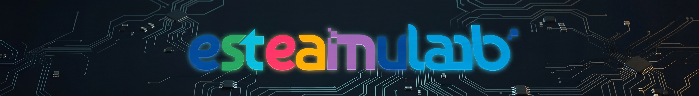

<div align="center">



  

# eSTEAMulab Hardware Kit

**O seu ponto de partida para prototipagem rápida e Internet das Coisas (IoT).**

  

[](#)

[](#)

[](#)

[](#)

  

</div>

  

---

  

## Sobre o Projeto

  

Bem-vindo ao repositório central de hardware do **eSTEAMulab**!

  

Este guia foi criado para que **professores e estudantes** possam validar componentes eletrônicos em questão de minutos. Sabemos que na bancada do laboratório, o tempo é valioso. Por isso, organizamos códigos limpos, esquemas visuais e explicações diretas para que você pule a etapa de "bater cabeça" com configurações e vá direto para a criação do seu projeto.

  

---

  

## Como Utilizar este Guia?

  

A ideia aqui é **copiar, montar e testar**. Para cada sensor ou atuador disponível no laboratório, você encontrará uma pasta dedicada contendo tudo o que precisa:

  

1. **Escolha o Componente:** Navegue pelo nosso índice abaixo.

2. **Entenda a Lógica:** Leia o arquivo `README.md` dentro da pasta do componente para um resumo de como ele funciona.

3. **Monte o Circuito:** Siga o esquema elétrico visual (pinagem fácil).

4. **Rode o Código:** Abra o arquivo `.ino` ou `.cpp`, faça o upload para a sua placa e veja a mágica acontecer!

  

---

  

## Acervo de Componentes (Índice Rápido)

  

Escolha o que você quer testar hoje. Clique no link da pasta para acessar os materiais.

  

### Básico (Interfaces de entrada/saída)

| Componente | Função Principal | Massa de Teste | Acesso Rápido |

| :--- | :--- | :---: | :--- |

| **LEDs e Relés** | Acender luzes e acionar cargas | 🟢 | [📁 `/01-saidas-digitais`](./01-saidas-digitais/) |

| **Push Buttons** | Detectar toques e cliques | 🟢 | [📁 `/02-entradas-digitais`](./02-entradas-digitais/) |


  

### Intermediário (Sensores)

| Componente | Função Principal | Massa de Teste | Acesso Rápido |

| :--- | :--- | :---: | :--- |

| **HC-SR04** | Medir distância usando ultrassom | 🟡 | [📁 `/04-ultrassonico`](./04-ultrassonico/) |

| **DHT11 / DHT22** | Medir temperatura e umidade | 🟡 | [📁 `/05-sensor-dht`](./05-sensor-dht/) |

| **Servo Motor** | Criar movimento controlado e mecânico | 🟡 | [📁 `/06-servomotor`](./06-servomotor/) |

| **Display OLED** | Exibir textos e gráficos em uma tela | 🟡 | [📁 `/07-display-oled`](./07-display-oled/) |

| **LDR** | Sentir a intensidade da luz ambiente | 🟢 | [📁 `/03-sensor-ldr`](./03-sensor-ldr/) |

  

### Avançado (Conectando à Rede)

| Componente | Função Principal | Massa de Teste | Acesso Rápido |

| :--- | :--- | :---: | :--- |

| **Web Server** | Controlar o ESP32 pelo navegador do celular | 🔴 | [📁 `/08-esp32-webserver`](./08-esp32-webserver/) |

| **Integração IoT** | Enviar dados do laboratório para a nuvem | 🔴 | [📁 `/09-esp32-iot-cloud`](./09-esp32-iot-cloud/) |

  

---

  

## Como as pastas estão organizadas?

  

Toda pasta de componente segue o mesmo padrão para facilitar a vida de quem está ensinando e de quem está aprendendo:

  

```text

nome-do-componente/

├── README.md # Explicação simples, tabela de pinos e dicas

├── esquematico.png # Desenho visual de como ligar os fios na placa

└── codigo_exemplo.ino # Código em C++ comentado e pronto para rodar